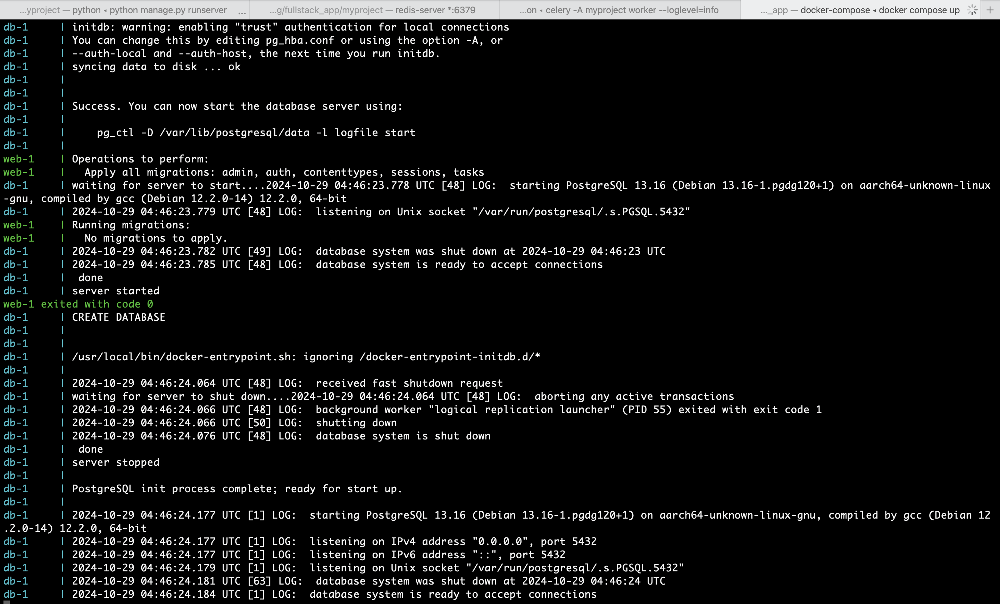
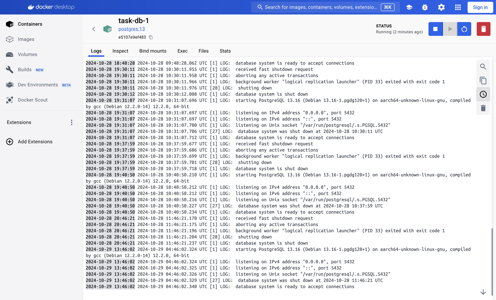

# Task List Application

This project is a task list application built with Django for the backend and React for the frontend. It utilizes Celery for background processing and PostgreSQL for database management.

## Table of Contents

- [Features](#features)
- [Technologies Used](#technologies-used)
- [Installation](#installation)
- [Setting Up the Backend](#setting-up-the-backend)
- [Setting Up the Frontend](#setting-up-the-frontend)
- [Running the Application](#running-the-application)
- [API Endpoints](#api-endpoints)
- [License](#license)
- [Contributing](#contributing)

## Features

- Create, read, update, and delete tasks.
- Background task processing with Celery for sending notifications.
- User-friendly interface built with React.
- RESTful API using Django Rest Framework.

## Technologies Used

- **Django**: Web framework for the backend.
- **Django Rest Framework**: Toolkit for building Web APIs.
- **PostgreSQL**: Database management system.
- **Celery**: Distributed task queue for handling background tasks.
- **Redis**: In-memory data structure store, used as a message broker for Celery.
- **React**: JavaScript library for building user interfaces.
- **Axios**: Promise-based HTTP client for making API requests.

Setting up and Running the Project
----------------------------------

### Clone the Repository

1. **Clone the GitHub Repository**:
   Open your terminal and run:
   ```bash
   git clone https://github.com/MuhammadCV/fullstack_app.git
   cd fullstack_app

### Backend (Django) and Celery

1. **Create and Activate Conda Environment**: Open your terminal and run:

   ```bash
   conda env create -f environment.yml
   conda activate task

2. **Start the Django Development Server**: This will start the server on the default address http://127.0.0.1:8000.
   
   ```bash
   cd myproject/
   python manage.py runserver

3. **In a New Terminal Window**: Activate your conda environment again and start the Redis Server:

   ```bash
   conda activate task
   redis-server


4. **In another New Terminal Window**: Activate your conda environment again and start the Celery Worker:

   ```bash
   conda activate task
   cd myproject
   celery -A myproject worker --loglevel=info

5. **Email notification Testing**: If you go to http://127.0.0.1:8000/api/tasks/ and post new task, it will print it on Celery Worker terminal and send an emial form unistar20172010@gmail.com to boboevm832000@gmail.com.


   
### Setting Up the Docker

1. **Install Docker**: For MacOS/Windows: Download Docker Desktop from Docker's official website and follow the installation instructions.
    
2. **Build and Run the Docker Compose Setup on new terminal**: Build the Docker Images: Run the following command from the root directory of your project:

   ```bash
   conda activate task
   cd fullstack_app
   docker-compose build

3. **Run the Docker Containers**: In the same directory start the containers with:

   ```bash
   docker-compose up


   
4. **Access Your Application**: Once everything is up, you should be able to access your Django application at http://localhost:8000.




### Frontend (React)

1. **Install Node.js**: Download and install Node.js from [nodejs.org](https://nodejs.org/). This will also install npm (Node Package Manager).

3. **In Another Terminal Window**: Navigate to your React app directory and start the development server:

   ```bash
   conda activate task
   cd task-list-app
   npm start
   
API Endpoints
-------------

-   **GET /api/tasks/**: Retrieve the list of tasks.
-   **POST /api/tasks/**: Create a new task.
-   **PUT /api/tasks/{id}/**: Update an existing task.
-   **DELETE /api/tasks/{id}/**: Delete a task.
